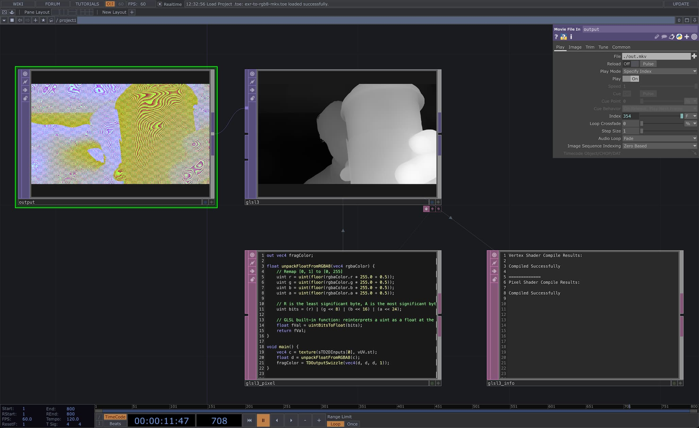

# exr-to-rgb8-mkv

This script converts depth maps in a `.exr` sequence into a mkv file, that can be decoded in shader in realtime.

Below is a screenshot of decoding mkv file using TouchDesigner:



## How it works

Depth data in `.exr` files are stored in 32-bit float, so I packed them to RGBA8 like this:

```python
for y in range(height):
    for x in range(width):
        fval = depth_arr[y, x]
        b = struct.pack('<f', fval)  # float → 4bytes (little endian)
        rgba[y, x, 0] = b[0]  # R
        rgba[y, x, 1] = b[1]  # G
        rgba[y, x, 2] = b[2]  # B
        rgba[y, x, 3] = b[3]  # A
```

To use the `.mkv` video as a depth map, we have to unpack it in GLSL etc to obtain the depth data:

```glsl
float unpackFloatFromRGBA8(vec4 rgbaColor) {
    // Remap [0, 1] to [0, 255]
    uint r = uint(floor(rgbaColor.r * 255.0 + 0.5));
    uint g = uint(floor(rgbaColor.g * 255.0 + 0.5));
    uint b = uint(floor(rgbaColor.b * 255.0 + 0.5));
    uint a = uint(floor(rgbaColor.a * 255.0 + 0.5));

    // R is the least significant byte, A is the most significant byte
    uint bits = (r) | (g << 8) | (b << 16) | (a << 24);

    // GLSL built-in function: reinterprets a uint as a float at the bit level
    float fVal = uintBitsToFloat(bits);
    return fVal;
}
```

## Usage

```
cd exr-to-rgb8-mkv
uv run main.py <EXR_DIRECTORY> <OUT_PATH>
```

Then it'll output an `.mkv` file to `OUT_PATH`.


## LICENSE

MIT
